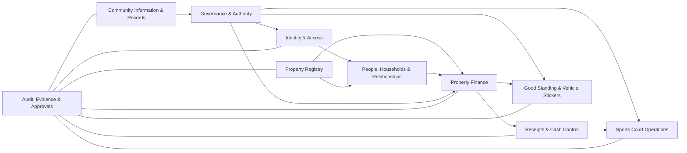
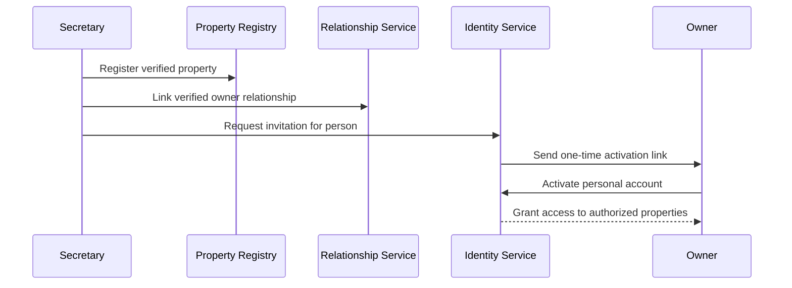
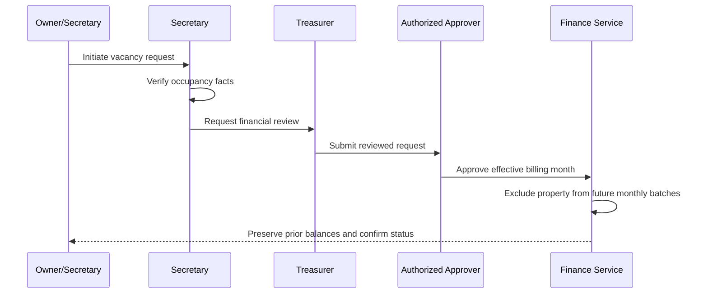
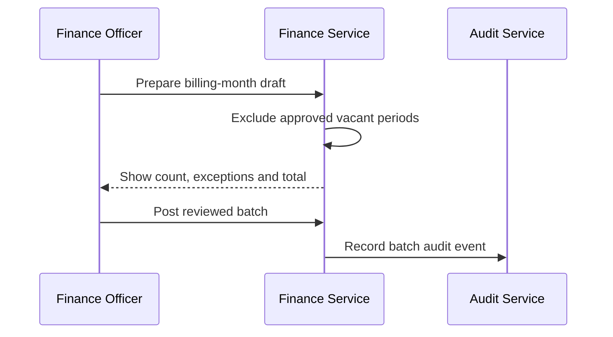
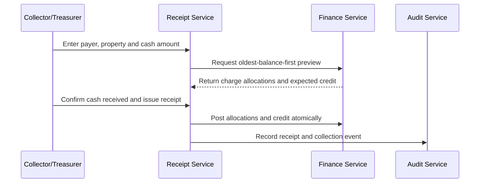
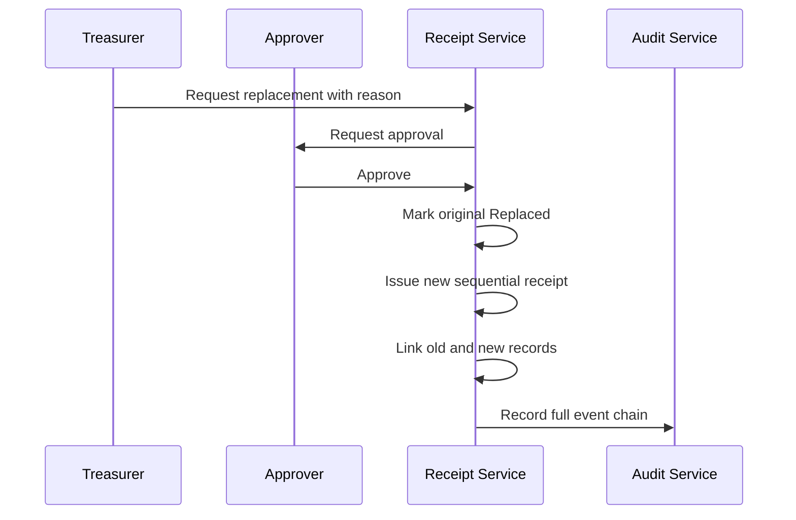
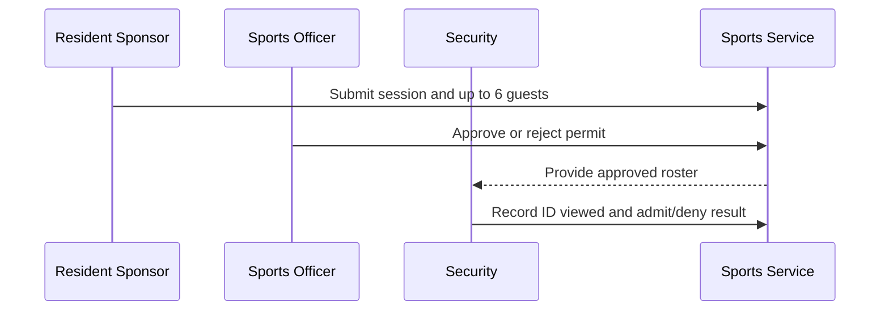

# Wonderland HOA System — Phase 2 Domain and Service Blueprint

## 1. Document Control

| Field | Value |
|---|---|
| Document status | **Product Owner Review Draft** |
| Version | **0.2** |
| Date created | **2026-08-04** |
| Project | Wonderland Homeowners Association Management System |
| Association | Wonderland Homeowners Association, Inc. |
| Community | Wonderland Townhomes, Barangay Namayan, Mandaluyong City |
| Phase | Phase 2 — Domain and Service Blueprint |
| Source authority | Phase 1 Policy, Governance and Controls Register v1.0 |
| Supporting sources | Legacy Repository Reconciliation and Technology-Stack Review v0.3; Governance and Operations Formalization Draft Pack v0.3 |
| Authority | This document defines the proposed business-domain and service design. It does not select a framework, approve a database implementation, amend HOA rules, deploy software, or authorize coding. |
| Documentation workflow | Drafted, reviewed, revised and approved in ChatGPT. The user places the finalized document into the repository manually. Claude Code remains reserved for later technical implementation. |

## 2. Purpose

This blueprint converts the approved Phase 1 facts, operating rules and internal controls into a coherent, framework-neutral system design.

It defines:

- the business concepts the system must represent;
- the boundaries between properties, people, accounts, households and association roles;
- the services and workflows required to operate the association;
- the records that must remain traceable;
- the difference between current operating facts, adopted product controls and items still requiring formal HOA adoption;
- the minimum viable product and recommended implementation order;
- invariants and acceptance criteria that later technical work must satisfy.

This blueprint deliberately does **not** decide whether the final implementation uses React/Vite, Next.js, Supabase Edge Functions, another server layer or another deployment model. Those decisions belong to Phase 3.

## 3. Source and Decision Hierarchy

When sources conflict, later implementation must use this order:

1. **Valid law, registered bylaws and formally adopted HOA decisions**
2. **Product Owner-approved Phase 1 controls and confirmed operating facts**
3. **This approved Phase 2 blueprint once finalized**
4. **Phase 3 architecture and repository-strategy decision**
5. **Legacy repository behavior**

The legacy source code is evidence of a previous implementation. It does not override confirmed Wonderland rules.

### 3.1 Status labels used in this blueprint

| Label | Meaning |
|---|---|
| **CONFIRMED RULE** | Officer-confirmed, resident-confirmed or written-evidence operating rule accepted as design input. |
| **ADOPTED CONTROL** | Product Owner-approved safeguard required in the target design. |
| **PENDING FORMAL HOA ADOPTION** | May be represented in the system but must not be enforced as formal HOA policy until valid authority exists. |
| **PROPOSED DESIGN DECISION** | Recommended product behavior requiring Product Owner approval during Phase 2. |
| **OPEN EVIDENCE ITEM** | Operational answer is incomplete or authoritative evidence remains unavailable. |
| **DEFERRED** | Not required in the first production MVP. |

## 4. Scope and Non-Goals

### 4.1 In scope

- property and structured address registry;
- owners, residents, tenants, representatives and households;
- personal user accounts and invitations;
- property financial accounts;
- monthly dues and vacancy-based billing suspension;
- cash collections, sequential receipts, payment allocations and property credits;
- financial corrections, reversals, waivers, write-offs and refunds;
- governance, Board, officer and committee assignments;
- authority and permission assignments;
- delinquency/good-standing decisions and vehicle-sticker eligibility;
- sports-court permits, rosters, violations, fines, restrictions and appeals;
- announcements, permanent Knowledge Base, policies, memoranda and forms;
- evidence, approvals and audit history;
- MVP boundaries and implementation sequence.

### 4.2 Out of scope for Phase 2 approval

- final frontend framework;
- final database vendor or ORM;
- exact SQL schema and migration syntax;
- exact API shape;
- visual design system and page layouts;
- production hosting and deployment;
- integration with GCash, banks or payment gateways;
- automatic legal conclusions;
- payroll, procurement, inventory or full accounting software;
- collection of government-ID images or ID numbers unless separately justified and approved;
- implementation of unapproved penalties or fees.

## 5. Core Design Principles

1. **Property-centred finance** — dues, balances and property credits belong to the property financial account.
2. **People are not properties** — ownership, residence, tenancy, household membership, system access and HOA assignments are separate relationships.
3. **Accounts belong to people** — no fake, shared, household or property login accounts.
4. **One person may relate to many properties** — an owner may access several separately billed properties through one personal account.
5. **One property may contain several households** — household count does not automatically multiply property dues.
6. **History is preserved** — changes create dated records, reversals or replacement links; material history is never silently overwritten.
7. **Policy is versioned** — effective dates and source authority determine which rule applied at a given time.
8. **Authority is explicit** — material actions record initiator, approver, executor and reviewer when applicable.
9. **Separation of duties** — no one person should initiate, approve, execute and audit the same material financial action.
10. **Least privilege** — system capability is derived from current, verified assignments and relationships.
11. **No client-supplied actor identity** — later technical implementation must derive the acting user from the authenticated session.
12. **Formalization is visible** — a system setting must not pretend to create legal authority.
13. **Accessibility and low-bandwidth use are product requirements** — they are not optional cosmetic enhancements.
14. **MVP discipline** — core property, finance, receipt and records controls take priority over peripheral modules.

## 6. Ubiquitous Language

The following terms must be used consistently in documents, UI labels, APIs and later database design.

| Term | Definition |
|---|---|
| **Property** | A separately recognized physical HOA property with an immutable system identity, official house number and official street. |
| **Official address** | The property’s approved house number plus official street. A corner street may be a note, not a second identity. |
| **Person** | A natural person known to the association. A person may or may not have a system account. |
| **User account** | Authentication identity belonging to one person. |
| **Owner relationship** | Dated relationship showing a person or entity owns or co-owns a property. |
| **Resident relationship** | Dated relationship showing a person is authorized to reside at a property. |
| **Tenant relationship** | Dated relationship showing a person occupies under a rental/tenancy arrangement. |
| **Authorized representative** | Person allowed to act for an owner or property within a defined scope and period. |
| **Household** | A group of people living together at one property. A property may have more than one household. |
| **Occupancy period** | Dated occupied or vacant state of a property. |
| **Property financial account** | Financial ledger and balance context belonging to one property. |
| **Monthly charge** | A property-level dues assessment for one billing month using the effective fee-rule version. The confirmed current amount is ₱400. |
| **Cash collection** | Actual cash received by an authorized collector. |
| **Receipt** | Sequential association document acknowledging a cash collection. |
| **Receipt line** | Classified component of a receipt, such as dues or sports fine. |
| **Allocation** | Link that applies a dues receipt amount to a specific monthly charge. |
| **Property credit** | Excess property-related cash retained for application to the next monthly due. |
| **Financial adjustment** | Traceable correction, reversal, waiver, write-off or refund event. |
| **Good standing** | Governance status determined under formally adopted rules; it is not merely a UI label. |
| **Assignment** | Dated office, Board or committee role held by a person. |
| **Capability** | Specific system action granted by an active assignment or approved delegation. |
| **Sports permit** | Approved authorization for a registered resident sponsor and outside-player roster to use the court. |
| **Violation ticket** | Formal sports-rule violation record that may create a fine or restriction. |
| **Knowledge article** | Current, resident-friendly guidance linked to authoritative source material when available. |
| **Policy document** | Bylaw, resolution, memorandum, notice, rule, form or other controlled association record. |
| **Audit event** | Append-only record of a material system action and its context. |

## 7. System Context and Actors

### 7.1 Human actors

- Property owner
- Co-owner
- Resident
- Tenant
- Household member
- Authorized representative
- President
- Vice President
- Treasurer
- Assistant Treasurer
- Secretary
- Assistant Secretary
- Auditor
- Board member
- Sports Officer / Sports Committee member
- Peace & Order / Security personnel
- Cleanliness & Beautification personnel
- Authorized cash collector
- System administrator
- Outside sports guest
- General public reader, only where content is intentionally public

### 7.2 External organizations

- Wonderland Homeowners Association, Inc.
- Mandaluyong City Government for city services such as garbage collection
- Future service providers approved in Phase 3 or later

### 7.3 System boundary

The system records HOA operations. It does not replace:

- Board or membership meetings;
- lawful resolutions and bylaw amendments;
- physical verification where needed;
- actual cash custody;
- external government or financial records;
- professional legal or accounting judgment.

## 8. Domain Map

## 9. Property Registry Domain

### 9.1 Property

A Property must have:

- immutable property ID;
- official house-number text;
- official street from the controlled Wonderland street list;
- normalized address key for duplicate detection;
- optional suffix already included in the house-number value, such as `117-B`;
- optional corner/location note;
- active, retired, merged, divided or disputed lifecycle status;
- date created and source evidence;
- full change history.

### 9.2 Controlled street list

Allowed official streets in the current scope:

- Wonderland Avenue
- Sampaguita
- Yellowbell
- Orchids
- Sunflower

`Circle` is excluded and must not be selectable as an official property street.

### 9.3 Address uniqueness

**ADOPTED CONTROL:** house number alone is never a global key.

Normal uniqueness is based on:

- normalized house number; and
- official street.

The system must still permit an authorized exception when the HOA has two separately recognized properties with the same visible house number and street, such as front/rear or informal duplicate numbering. Such exceptions require:

- distinct immutable property IDs;
- a distinguishing label or internal property reference;
- reason;
- supporting evidence or Secretary verification;
- audit history.

### 9.4 Corner properties

A corner property has one official street for identity and billing. Secondary street information is optional location metadata and must not create a second property record.

### 9.5 Merged and divided properties

The current existence of merged/divided cases remains unconfirmed, but the model must support them without rewriting history.

- A merge retires source properties and creates or designates a resulting property.
- A division retires or transforms the source property and creates resulting properties.
- Old financial and occupancy records remain attached to the historical property IDs.
- Financial transfer between old and new properties requires a separately approved migration/adjustment record.

No merge or division happens through simple address editing.

### 9.6 Property lifecycle states

- Active
- Retired
- Merged
- Divided
- Disputed
- Archived

Occupancy status is separate from property lifecycle.

## 10. People, Ownership, Residence and Household Domain

### 10.1 Person

A Person record may contain only information required for association operations. At minimum:

- immutable person ID;
- full name;
- preferred display name, optional;
- contact details, subject to privacy controls;
- active/inactive status;
- evidence/source reference;
- linked user account, optional.

A person may exist without a user account.

### 10.2 Property relationships

Use dated relationship records rather than fixed person fields on Property.

Relationship types:

- Owner
- Co-owner
- Resident
- Tenant
- Household member
- Authorized representative
- Former owner
- Former resident
- Former tenant

Each relationship includes:

- person;
- property;
- relationship type;
- start date;
- end date, optional;
- active status;
- verification status;
- source/evidence;
- authority scope where applicable.

### 10.3 Ownership

- One person may own several properties.
- One property may have several owners.
- Ownership change does not move, delete or reset the property financial account.
- Historical owners remain visible with ended relationship dates.

### 10.4 Household

A Household belongs to one property during a dated period.

A property may contain:

- one household;
- multiple households sharing one structure;
- no active household during an approved vacancy.

Household count does not create additional monthly dues unless a future formally adopted policy changes the property definition itself.

### 10.5 Occupancy

Occupancy is derived from approved occupancy-period records, not merely from whether an account exists.

Occupancy states:

- Occupied
- Vacant pending verification
- Vacant approved
- Reoccupation pending
- Disputed

## 11. Identity and Access Domain

### 11.1 Account-to-person rule

- One personal account belongs to one person.
- One person should normally have one active account.
- A personal account may provide access to multiple authorized properties.
- A property, household or committee must not have a shared login.

### 11.2 Provisioning workflow

1. Secretary or authorized administrator verifies the person and property relationship.
2. Administrator creates/imports the relationship.
3. System sends a one-time invitation.
4. Person activates the account and creates a private password.
5. Invitation expires after a defined period.
6. Unused invitation may be revoked and reissued.
7. Access is calculated from active relationships and assignments.

### 11.3 Access revocation

Ending an ownership, residence, tenancy or assignment relationship must:

- remove future access no longer justified;
- preserve historical attribution and records;
- not delete the person or prior actions;
- support immediate session revocation for security-sensitive cases.

### 11.4 Authentication requirements for later technical design

- secure password reset;
- expiring invitations;
- no permanent passwords distributed by developers or officers;
- session-derived actor identity;
- active-person and active-assignment enforcement;
- least-privilege permissions;
- auditable administrative access changes.

## 12. Governance, Board, Officer and Committee Domain

### 12.1 Organizational entities

The system must represent:

- Board;
- principal office;
- committee or functional group;
- delegated authority;
- term/effective period;
- source resolution, election result or appointment record.

### 12.2 Assignment

An Assignment links one Person to one organizational position for a period.

Required fields:

- person;
- assignment type;
- office/committee;
- start date;
- end date, optional;
- election/appointment basis;
- source document;
- active/inactive status;
- delegated capabilities;
- replacement or revocation history.

A person may hold several assignments simultaneously.

### 12.3 Capability model

Authorization should use specific capabilities, not only broad role names.

Illustrative capability groups:

- `property.read`
- `property.manage`
- `relationship.verify`
- `account.invite`
- `charge.prepare`
- `charge.post`
- `payment.record`
- `receipt.issue`
- `receipt.cancel.request`
- `receipt.cancel.approve`
- `financial.adjust.request`
- `financial.adjust.approve`
- `audit.review`
- `vacancy.verify`
- `vacancy.approve`
- `good_standing.evaluate`
- `sticker.issue`
- `sports.permit.approve`
- `sports.violation.issue`
- `sports.sanction.recommend`
- `board.decision.record`
- `document.publish`
- `knowledge.manage`

Exact capability-to-assignment mapping is approved in Phase 3 or a later authority specification, using the Phase 1 matrix as the controlling input.

### 12.4 Board decisions

Board-level decisions require a Decision Record containing:

- decision type;
- subject;
- meeting/resolution reference;
- date;
- participating/approving Board members where required;
- outcome;
- effective date;
- conditions;
- appeal/review path;
- source document;
- system actions authorized by the decision.

The system must not treat a configuration toggle as a substitute for a Board decision.

## 13. Policy and Effective-Date Domain

### 13.1 Policy version

Rules that can change over time must be versioned, including:

- monthly dues amount;
- vehicle-sticker fee;
- allocation rule;
- vacancy billing treatment;
- receipt controls;
- good-standing criteria;
- vehicle-sticker eligibility;
- sports schedules and sanctions;
- authority delegations.

Each policy version includes:

- policy type;
- version;
- status: Draft, Approved, Effective, Superseded, Withdrawn;
- issue date;
- effective start date;
- effective end date, optional;
- source authority;
- source document;
- summary of operational effect.

### 13.2 Historical evaluation

The system must be able to explain which policy applied when a charge, permit, receipt, sticker or sanction was created.

### 13.3 Effective-dated fee rules

**ADOPTED CONTROL:** monthly dues and vehicle-sticker fees are configurable through effective-dated fee-rule versions.

Confirmed current amounts:

- monthly association dues: **₱400 per property per month**;
- vehicle sticker fee: **₱200 per sticker**.

A fee version includes:

- fee type;
- amount;
- effective start date;
- optional effective end date;
- status: Draft, Approved, Active, Superseded or Cancelled;
- approval source or resolution reference;
- approving authority;
- reason for change;
- officer who encoded and activated the approved version.

Rules:

1. An officer does not overwrite an active fee amount directly.
2. A future increase or decrease requires a new fee version.
3. The required approval or ratification and effective date must be recorded before activation.
4. Only one fee version may apply to a fee type for a given date or billing/sticker period.
5. Charges and receipts retain the amount and fee version used when created.
6. A later fee change never recalculates historical charges, receipts, allocations, credits, balances or reports.
7. Superseded and cancelled fee versions remain auditable.
8. Authority to encode or activate a fee version is separate from authority to approve the fee itself.

## 14. Property Financial Account Domain

### 14.1 One account per property

Every active property has one property financial account.

The account persists across:

- owner changes;
- tenant changes;
- household changes;
- account invitations and deactivations;
- vacancy and reoccupation.

### 14.2 Ledger-first design

Balances must be derived from traceable ledger events, not manually overwritten totals.

Ledger categories include:

- monthly dues charge;
- dues payment allocation;
- property credit creation;
- property credit application;
- charge correction/reversal;
- waiver;
- write-off;
- refund obligation and payout;
- migration opening balance, only when approved;
- other future property charges, only after policy approval.

Sports fines are not property dues and must remain in a separate category and obligation context.

### 14.3 Monthly charge

Current confirmed rule:

- current amount: **₱400**;
- unit: per property;
- frequency: monthly;
- no formal due date;
- no late-payment penalty;
- no charge during an approved vacant period;
- amount is supplied by the effective fee-rule version and is not permanently hardcoded.

Each monthly charge includes:

- property account;
- billing month;
- applicable fee-rule/policy version;
- amount fixed at posting time;
- status;
- posting date;
- source batch or manual action;
- reversal/waiver/write-off links, when applicable.

There must be at most one active ordinary monthly dues charge per property per billing month. Activating a later dues rate must not modify an already posted charge.

### 14.4 Charge lifecycle

- Draft
- Posted
- Partially paid
- Paid
- Reversed
- Waived
- Written off

A charge is not deleted after posting.

### 14.5 Monthly billing batch

**PRODUCT OWNER-APPROVED DESIGN DECISION:** the MVP uses a reviewed posting workflow rather than an unattended automatic charge job.

1. System prepares a draft batch for the target billing month.
2. Vacant-approved properties are excluded with a visible reason.
3. Authorized finance officer reviews property count, vacancy exclusions, exceptions, applied fee version and total.
4. Authorized poster confirms the complete batch.
5. Charges become Posted in one atomic operation.
6. Audit record captures preparer, reviewer/poster, count, amount and fee/policy version.

This preserves efficiency without allowing silent recurring charges under an unreviewed rule.

## 15. Vacancy Domain

### 15.1 Vacancy record

A Vacancy Case includes:

- property;
- requester or initiating officer;
- claimed vacancy date;
- verification evidence;
- Secretary verification;
- Treasurer financial review;
- Board-authorized approval;
- approved effective billing month;
- end/reoccupation date;
- status;
- reason and notes;
- audit history.

### 15.2 Vacancy states

- Requested
- Under verification
- Approved
- Rejected
- Active
- Ended
- Cancelled
- Disputed

### 15.3 Billing effect

- Existing balances before the approved effective month remain.
- New monthly dues are not generated during the active approved period.
- Reoccupation resumes billing from the approved month.
- No retroactive deletion is permitted.
- A retroactive correction requires a separately authorized financial adjustment.

## 16. Cash Collection, Receipt and Allocation Domain

### 16.1 Cash-only MVP

The initial approved payment method is Cash.

The UI and services must not present GCash, bank transfer or cheque as accepted methods in the initial production MVP.

### 16.2 Cash collection

A Cash Collection records:

- collection ID;
- actual receipt date/time;
- payer;
- receiving officer/collector;
- amount received;
- receipt;
- line items;
- notes;
- status;
- audit context.

### 16.3 Association-wide receipt series

Receipt numbers are:

- sequential;
- unique;
- association-wide;
- never reused;
- retained even if cancelled, voided or replaced.

Receipt fields include:

- receipt number;
- status;
- issue date/time;
- payer;
- property, when relevant;
- issuer;
- line items;
- total;
- physical signature/copy metadata where applicable;
- replacement links;
- archived image, optional.

### 16.4 Receipt lines

Line types in the initial blueprint:

- Monthly dues
- Sports fine
- Other approved association receipt category, disabled until configured under an approved policy

A single receipt may contain several lines, but each line has one accounting category and source obligation.

### 16.5 Dues allocation

Confirmed allocation rule: oldest unpaid balance first.

Allocation sequence:

1. Select oldest Posted or Partially paid monthly charge.
2. Apply available dues-line amount.
3. Continue month by month until the dues-line amount is exhausted or all outstanding charges are settled.
4. Any remaining dues-line amount becomes property credit.
5. Record every allocation separately.

The system must show the proposed allocation before final receipt issuance.

### 16.6 Partial and multi-month payments

- A receipt may partially settle one monthly charge.
- A receipt may settle several monthly charges.
- Receipt output lists every billing month and amount covered.
- Remaining charge balance remains visible.

### 16.7 Overpayment and next-month credit

- Excess dues cash creates a property-credit ledger entry.
- Credit is applied to the next monthly charge after it is posted.
- Credit application is recorded separately from credit creation.
- Credit is never silently subtracted from a stored balance.
- Credit remains with the property through owner or occupancy changes.

### 16.8 Receipt lifecycle

Statuses:

- Issued
- Cancelled
- Voided
- Replaced

Rules:

- reason is mandatory for non-Issued states;
- actor and approver are recorded;
- original number remains reserved;
- replacement receives a new number;
- original and replacement are cross-linked;
- underlying accounting is corrected through reversal or replacement transactions;
- deletion is prohibited.

## 17. Financial Adjustments, Refunds and Write-Offs

### 17.1 Adjustment case

Material financial changes use an Adjustment Case rather than direct editing.

Types:

- Encoding correction
- Charge reversal
- Payment reversal
- Waiver
- Write-off
- Refund
- Historical migration correction

Every case includes:

- subject account/transaction;
- requested change;
- reason;
- evidence;
- initiator;
- required approver;
- decision;
- executor;
- auditor review;
- resulting ledger events;
- timestamps.

### 17.2 Correction

An obvious encoding error may be corrected through a reversal and corrected entry approved by the President or formally designated financial approver.

### 17.3 Waiver and write-off

- Treasurer recommends.
- Board resolution approves.
- Treasurer records the approved ledger event.
- Auditor reviews.
- Original charge remains visible.

### 17.4 Refund

A refund has separate states:

- Requested
- Verified
- Approved
- Rejected
- Ready for payout
- Paid
- Cancelled

Approval does not mean paid.

Ordinary refund:

- Treasurer prepares;
- second authorized officer approves;
- Treasurer records payout;
- Auditor reviews.

Exceptional/disputed refund requires Board resolution.

## 18. Good Standing and Vehicle-Sticker Domain

### 18.1 Separation of facts and governance decision

The system distinguishes:

- **Financial facts** — outstanding property balances and payment history;
- **Good-standing decision** — formal association status under approved rules;
- **Sticker eligibility** — result of the adopted sticker policy.

A Treasurer may verify balances but must not arbitrarily create a sanction.

### 18.2 Good-standing case

A case may contain:

- person/member;
- related property or properties;
- financial evidence;
- notice date;
- response/reconsideration period;
- Board resolution;
- effective date;
- status;
- expiry/review date;
- appeal outcome.

### 18.3 Vehicle and sticker

Vehicle record:

- vehicle ID;
- registered owner/person;
- associated property;
- plate number or approved identifier;
- vehicle type;
- active/inactive status;
- supporting documents as approved.

Sticker issuance record:

- sticker number;
- vehicle;
- property;
- issuance period/year;
- eligibility result;
- issuer;
- issue date;
- expiry date;
- status: Issued, Revoked, Replaced, Expired;
- replacement/revocation reason.

### 18.4 Confirmed current sticker rule and formalization status

Confirmed current operating rule:

1. A property with no outstanding monthly dues is financially eligible to purchase a sticker.
2. A property with outstanding dues may become eligible after paying at least **one current monthly due amount**, presently ₱400, toward its oldest outstanding balance at the time of application.
3. The remaining balance stays outstanding.
4. Sticker eligibility does not label the property fully paid or automatically establish general good standing.
5. The confirmed current sticker fee is **₱200 per sticker**.
6. The sticker fee is a separate charge and receipt line item.
7. The fee uses the effective-dated fee-version controls in Section 13.3.
8. Treasurer or another authorized finance officer verifies the payment condition and applicable fee.
9. A separately authorized officer or sticker custodian issues the physical sticker.

**Formalization status:** the operating rule is confirmed and the written policy has been drafted, but production enforcement remains **PENDING FORMAL HOA ADOPTION**, member notice, and an approved correction/appeal path.

## 19. Sports-Court Operations Domain

### 19.1 Court schedule

Confirmed operating windows:

- 7:30 a.m.–11:30 a.m.
- 3:30 p.m.–6:30 p.m.

The court is closed to everyone from 11:30 a.m.–3:30 p.m.

### 19.2 Sports permit

A permit includes:

- permit ID/number;
- sponsoring registered resident;
- sponsor’s related property;
- requested date and session;
- outside-player roster, maximum six;
- submission date;
- approving Sports Officer/Committee member;
- status;
- approval/rejection reason;
- cancellation history;
- gate verification result.

### 19.3 Guest roster and ID verification

The system records only what the approved workflow requires.

Initial privacy-preserving design:

- guest name;
- roster position;
- ID viewed: yes/no;
- verified by;
- verification time;
- admitted/denied status;
- denial reason.

The MVP does not store ID images or full ID numbers.

### 19.4 Permit states

- Draft
- Submitted
- Approved
- Rejected
- Cancelled
- Completed
- No-show

### 19.5 Violation

A Violation record includes:

- violation ID/ticket number;
- date/time;
- rule violated;
- offender type: Resident or Outside Guest;
- offender or guest reference;
- sponsoring resident, when applicable;
- permit/session;
- reporting Security/Sports Officer;
- evidence/notes;
- offense sequence;
- recommended sanction;
- decision and appeal status.

### 19.6 Sanctions

- First offense: warning and correction/exit as applicable.
- Second offense: formal ticket and ₱500 fine under the approved rule.
- Third offense/serious misconduct: recommendation for material restriction or ban.

Long-term or indefinite restriction:

- Sports Officer recommends;
- Board decides;
- start date and review status are recorded;
- no invented automatic duration;
- restriction remains until Board review/lifting when no fixed duration exists;
- appeal/review channel is recorded.

### 19.7 Sports fine

A fine obligation is linked to the violation ticket and liable person/sponsor.

It is not a property dues charge.

Payment:

- may appear on the same cash receipt as dues;
- uses a separate receipt line and ledger category;
- does not alter dues allocation;
- may drive privilege restoration only according to the approved sanction rule.

## 20. Community Information and Records Domain

### 20.1 Announcements

Purpose: temporary, time-sensitive communications.

Fields:

- title;
- content;
- audience;
- issue date/time;
- expiry date/time, optional;
- issuing office/committee;
- approval/source;
- status;
- attachments;
- revision history.

Targeting must be enforced, not decorative.

### 20.2 Knowledge Base

Purpose: current, reusable resident guidance.

Initial categories:

- Dues and payments
- Receipts and balances
- Properties and accounts
- Vehicle stickers and good standing
- Sports court and permits
- Guests and security
- Garbage and sanitation
- Complaints and requests
- HOA contacts and governance
- Frequently asked questions

Each article includes:

- title and summary;
- body;
- category;
- audience;
- source document(s), when available;
- effective date;
- last reviewed date;
- reviewer/source authority;
- status: Draft, Published, Superseded, Archived;
- revision history.

Confirmed garbage article content:

> Garbage may be placed outside daily beginning at 4:00 p.m. for all occupied households. The Mandaluyong City garbage truck normally arrives at approximately 6:00 p.m. No known HOA penalty applies to the timing rule.

### 20.3 Policies and Documents

Document types:

- Registration/legal record
- Bylaw and amendment
- Board resolution
- Meeting minutes
- Memorandum
- Notice
- Rules and regulations
- Permit/form template
- Financial policy
- Officer/election record
- Superseded document

Required metadata:

- controlled document ID;
- title;
- type;
- issuing authority;
- issue date;
- effective date;
- version;
- status;
- supersedes/superseded-by links;
- audience/access classification;
- file attachment;
- checksum or integrity metadata in later technical design;
- retention category.

### 20.4 Forms

Forms may be printable, downloadable or later converted into system workflows. A form template must be versioned so submitted records retain the version used.

## 21. Complaints and Visitor Records

### 21.1 Complaints

Classification: **MVP-CANDIDATE, AFTER CORE FINANCE**.

A complaint workflow should preserve:

- complainant;
- property;
- subject and description;
- category;
- submission date;
- assigned officer;
- status;
- actions and responses;
- resolution;
- confidentiality level;
- audit history.

Resident visibility must be identity-based, never name-string matching.

### 21.2 Visitor records

Classification: **DEFERRED / RESEARCH FURTHER**.

Before production implementation, HOA must confirm:

- purpose;
- resident visibility;
- fields collected;
- retention period;
- authorized viewers;
- whether ordinary visitor logs are distinct from sports guest rosters.

The first MVP does not require a general visitor-history portal.

## 22. Evidence, Approvals and Audit Domain

### 22.1 Evidence record

Material decisions may link to:

- document;
- image;
- receipt copy;
- resolution;
- form;
- note of verbal confirmation;
- external reference.

Evidence has access classification and retention metadata.

### 22.2 Approval record

An Approval records:

- request/case;
- required authority;
- approver person and active assignment;
- decision;
- date/time;
- reason/conditions;
- evidence;
- delegation source, when applicable.

### 22.3 Audit event

Audit events are append-only and include:

- event type;
- subject type and ID;
- authenticated actor;
- actor assignment/capability at the time;
- timestamp;
- previous and new state summary;
- reason;
- approval reference;
- request/session context;
- correlation ID;
- source service.

### 22.4 Mandatory audit coverage

At minimum:

- property creation and address change;
- ownership/residency/tenancy changes;
- invitations and access revocation;
- officer/committee assignments;
- policy publication and supersession;
- vacancy decisions;
- monthly batch posting;
- cash collections and receipts;
- receipt cancellation/void/replacement;
- allocations and credits;
- financial adjustments and refunds;
- good-standing decisions;
- sticker issuance/revocation/replacement;
- sports permits, violations, fines and bans;
- material document/knowledge publication.

## 23. Privacy and Data Classification

### 23.1 Classification levels

- **Public** — intentionally public notices and guidance.
- **Community** — authenticated residents/owners.
- **Operational** — officers and authorized staff.
- **Sensitive** — financial, complaint, visitor and sanction records.
- **Restricted** — access-control administration, confidential Board matters and sensitive evidence.

### 23.2 Data minimization

- Do not collect identity-document copies for sports guests in the initial design.
- Do not expose the master property/person list publicly.
- Do not use names as authorization keys.
- Do not store passwords or distribute permanent credentials.
- Do not include personal account details in policy documents.

### 23.3 Retention

A proposed records-retention schedule now exists in the Governance and Operations Formalization Draft Pack v0.3, but it is not yet formally adopted.

Until adoption and appropriate legal/accounting review:

- no automatic destructive deletion of financial, receipt, governance or audit records;
- archive rather than delete;
- restrict access to stale sensitive records;
- apply legal/audit holds to affected records;
- support configurable retention schedules by record category.

## 24. Service Blueprint

### 24.1 Identity and Access Service

Responsibilities:

- person-account linking;
- invitations;
- account activation;
- password reset;
- session/access revocation;
- capability resolution from relationships and assignments.

Does not own property, finance or governance facts.

### 24.2 Property Registry Service

Responsibilities:

- property creation;
- official address validation;
- duplicate exception workflow;
- property lifecycle;
- merge/divide relationship history;
- property master-list export/import controls.

### 24.3 People and Relationship Service

Responsibilities:

- person registry;
- owner/resident/tenant/representative relationships;
- household membership;
- relationship verification and ending;
- occupancy derivation support.

### 24.4 Governance and Authority Service

Responsibilities:

- Board/officer/committee structure;
- assignments and terms;
- delegated capabilities;
- Board decision records;
- authority validation for approvals.

### 24.5 Policy and Records Service

Responsibilities:

- policy versions and effective dates;
- controlled documents;
- forms;
- memoranda and resolutions;
- source links for knowledge articles.

### 24.6 Property Finance Service

Responsibilities:

- property financial accounts;
- monthly billing batches;
- monthly charges;
- balances;
- vacancy billing exclusions;
- allocations and credits;
- adjustment/refund cases.

### 24.7 Receipt and Cash Control Service

Responsibilities:

- sequential receipt register;
- cash collection;
- receipt lines;
- receipt issuance;
- cancellation/void/replacement lifecycle;
- receipt copy/archive metadata.

### 24.8 Good Standing and Sticker Service

Responsibilities:

- financial fact snapshot;
- good-standing case and Board decision linkage;
- eligibility evaluation;
- vehicle registry;
- sticker issuance, replacement, expiry and revocation.

### 24.9 Sports Operations Service

Responsibilities:

- schedule rules;
- permits and rosters;
- gate verification;
- violations and tickets;
- fines;
- restrictions, bans and appeals.

### 24.10 Community Information Service

Responsibilities:

- announcements;
- Knowledge Base;
- audience targeting;
- publication workflow;
- source-policy links;
- supersession and review reminders.

### 24.11 Audit and Evidence Service

Responsibilities:

- append-only audit events;
- evidence references;
- approval records;
- correlation across services;
- audit and compliance reporting.

## 25. Cross-Domain Workflows

### 25.1 Initial property and owner onboarding

### 25.2 Vacancy and billing suspension

### 25.3 Monthly billing

### 25.4 Cash dues payment

### 25.5 Receipt replacement

### 25.6 Sports permit and gate verification

## 26. Reports and Operational Views

Initial required reports/views:

### 26.1 Property and relationship

- master property list;
- properties by street;
- owner with multiple properties;
- active owners/residents/tenants by property;
- vacant properties and effective periods;
- relationship-history report.

### 26.2 Finance and receipts

- monthly billing batch summary;
- property statement of account;
- outstanding balances by property;
- payment and allocation history;
- property-credit report;
- sequential receipt register;
- cancelled/voided/replaced receipt report;
- daily cash collection summary;
- sports-fine collection report;
- adjustment, waiver, write-off and refund register.

### 26.3 Governance and access

- active officers and committees;
- assignment terms and evidence gaps;
- capability/authority matrix;
- invitation and access-revocation report;
- Board decisions pending implementation.

### 26.4 Operations

- sticker issuance register;
- good-standing cases;
- sports permits and guest rosters;
- violation/fine/sanction register;
- Knowledge Base review status;
- current and superseded policy documents.

## 27. MVP Boundary

### 27.1 MVP goal

Deliver a controlled, usable foundation for the HOA’s highest-risk and highest-frequency records without reproducing the legacy prototype’s unsafe assumptions.

### 27.2 Included in first production MVP

1. Identity, invitation and access revocation.
2. Property registry and official address model.
3. People, ownership, residence, tenancy and household relationships.
4. Officer/Board/committee assignments sufficient for permissions.
5. Property financial accounts.
6. Vacancy workflow and billing suspension.
7. Reviewed monthly billing batches.
8. Cash collections.
9. Sequential receipts and full receipt lifecycle.
10. Oldest-balance-first allocations, partial payments and multi-month payments.
11. Property credits and next-month application.
12. Financial adjustment cases and audit trail.
13. Basic property statements and receipt/cash reports.
14. Announcements, Knowledge Base and controlled document archive.
15. Audit and evidence foundation.

### 27.3 Included after the core MVP foundation

1. Good-standing cases and vehicle-sticker register, after formal policy adoption.
2. Sports permits, rosters, violations, fines, restrictions and appeals.
3. Complaints modernization.
4. Expanded governance reports.

### 27.4 Deferred

- general visitor-history portal;
- GCash/bank-transfer workflows;
- automated external payment reconciliation;
- PWA/offline mode beyond essential low-bandwidth optimization;
- public website or public resident directory;
- advanced analytics and predictive reporting;
- native mobile applications;
- automatic legal-document interpretation.

## 28. Recommended Implementation Order

The order below is a domain dependency sequence, not a framework decision.

### Wave 0 — Engineering and security foundation

- approved Phase 3 architecture;
- repository strategy;
- environments and secrets;
- test framework and CI;
- migration discipline;
- authorization pattern;
- audit-event foundation.

### Wave 1 — Property and identity foundation

- streets and properties;
- people;
- property relationships;
- households and occupancy;
- invitations and access;
- governance assignments and capabilities.

### Wave 2 — Finance and receipt core

- property accounts;
- policy versions;
- vacancy cases;
- monthly charges and batches;
- cash collections;
- receipt series;
- allocations and credits;
- corrections and reports.

### Wave 3 — Information and governance records

- controlled documents;
- memoranda/resolutions/forms;
- announcements;
- Knowledge Base;
- officer terms and Board decisions.

### Wave 4 — Eligibility and community operations

- good standing;
- vehicles and stickers;
- sports permits and rosters;
- violations, fines and sanctions.

### Wave 5 — Service expansion

- complaints;
- visitor domain after privacy/retention decision;
- approved additional charges or services;
- enhanced analytics and exports.

## 29. Legacy Repository Disposition by Domain

| Legacy area | Blueprint disposition |
|---|---|
| `units.house_no` and global uniqueness | **Reimplement** as structured Property + official street model. |
| Property UUID relationships | **Preserve concept** of immutable property identity. |
| `homeowners` table | **Reimplement/modernize** into dated person-property relationships and households. |
| One static profile role | **Reimplement** as assignments plus capabilities. |
| Property-linked dues/payments | **Preserve concept**, redesign ledger and controls. |
| `billing_month` separate from payment date | **Preserve concept**. |
| Partial and multi-month allocation | **Preserve concept**, implement confirmed oldest-first rule. |
| Credit wallet | **Modernize** as property-credit ledger with separate creation/application events. |
| UUID-derived receipt number | **Remove**. |
| Printable receipt layout | **Preserve layout ideas**, rebuild official control. |
| Direct client actor IDs | **Remove**. |
| Existing SECURITY DEFINER functions | **Reimplement** after Phase 3 security design. |
| Existing Edge Function | **Reimplement or replace** after Phase 3. |
| Complaints | **Modernize after core MVP**. |
| Visitor logs | **Defer/research further**. |
| Announcements | **Modernize** and add enforced audience targeting. |
| Audit logs | **Reimplement as cross-domain append-only audit events**. |
| Dashboard | **Rebuild from verified services and policy-aware metrics**. |

## 30. System Invariants

These rules must remain true regardless of framework or database design.

### 30.1 Property and identity

1. Every property has one immutable internal ID.
2. House number alone is never globally unique.
3. `Circle` cannot be an official property street in the current scope.
4. One person can own many properties.
5. One property can have many people and households.
6. A property never requires a fake user account.
7. Ending a relationship never deletes its history.

### 30.2 Finance

8. Every ordinary monthly due belongs to one property and one billing month.
9. There is at most one active ordinary monthly charge per property per billing month.
10. An approved vacant period prevents new ordinary monthly charges for covered months.
11. Vacancy never deletes pre-existing balances.
12. Cash is the only accepted MVP payment method.
13. Dues allocation follows oldest unpaid balance first.
14. Every partial or multi-month allocation is individually traceable.
15. Excess dues money creates property credit.
16. Credit application is a separate ledger event.
17. Balances are derived from ledger events, not silently overwritten fields.
18. Dues and sports fines remain separate accounting categories.
19. Monthly-dues and sticker-fee changes use effective-dated fee versions.
20. A later fee version never changes historical charges, receipts, allocations, credits, balances or reports.

### 30.3 Receipts

21. Every issued receipt has one unique sequential number.
22. A receipt number is never reused or deleted.
23. A replacement receipt always has a new number.
24. Original and replacement receipts are cross-linked.
25. Receipt changes never erase underlying accounting history.
26. A receipt line points to its source obligation or category.

### 30.4 Authority and audit

27. Actor identity comes from the authenticated session.
28. Material actions require current capability and, where applicable, approval.
29. A person cannot audit their own material action as the sole independent reviewer.
30. Board/member authority cannot be created by a software setting.
31. Every material action has an append-only audit event.
32. Superseded policies and documents remain retrievable.

### 30.5 Sports and privacy

33. A sports permit cannot approve more than six outside players under the current policy.
34. The court cannot be booked during the 11:30 a.m.–3:30 p.m. closure.
35. Sports fines do not settle property dues.
36. Long-term/indefinite sanctions require Board decision and review status.
37. Guest ID copies are not stored in the MVP.

## 31. Acceptance Criteria

### 31.1 Property and people

- A Secretary can register `111 Sunflower` and `111 Wonderland Avenue` as distinct properties.
- The system can register `117-B` without treating it as an invalid number.
- One owner account can view three properties with three separate financial accounts.
- One property can contain two households while generating only one monthly charge.
- An ownership change preserves all prior property financial history.

### 31.2 Vacancy

- An approved vacancy with an effective month excludes the property from later billing batches.
- Prior unpaid charges remain visible and collectible.
- Reoccupation resumes billing without deleting the vacancy period.
- An unauthorized user cannot activate vacancy billing suspension.

### 31.3 Dues, payment and credit

- A monthly batch creates one ₱400 charge for every eligible property and none for active approved vacancies.
- A ₱250 cash payment partially settles the oldest ₱400 charge and leaves ₱150 outstanding.
- An ₱800 cash payment settles the two oldest ₱400 charges.
- A ₱500 cash payment against one ₱400 charge creates ₱100 property credit.
- The next posted ₱400 charge consumes the ₱100 credit through a recorded application and leaves ₱300 outstanding.
- An approved future dues increase creates a new effective-dated fee version without changing previously posted ₱400 charges or receipts.

### 31.4 Receipts

- Receipt numbers are issued sequentially and cannot be reused.
- A receipt lists every dues billing month and allocated amount.
- A receipt may include a dues line and a sports-fine line without mixing their ledgers.
- Replacing a receipt preserves the old number and issues a new linked number.
- Cancelling or voiding a receipt requires a reason and authorized approval.

### 31.5 Governance and access

- A person may simultaneously hold Vice President and Peace & Order assignments.
- Ending one assignment removes its capabilities without deleting historical actions.
- The Auditor can review but cannot be the sole initiator/approver/executor of the same write-off.
- A user cannot act as another person by supplying a different actor ID.

### 31.6 Sports

- A permit with seven outside guests cannot be approved.
- Security can see an approved roster and record admission without storing ID images.
- A second-offense ticket creates a separate ₱500 fine obligation.
- A long-term restriction cannot become final without the required Board decision.
- A financially delinquent property can qualify under the confirmed sticker rule after at least one current monthly due amount is applied to its oldest balance, while the remaining balance stays outstanding.
- A sticker is charged at the confirmed current ₱200 fee, and a later approved sticker-fee version does not alter prior sticker receipts.

### 31.7 Information and documents

- A garbage Knowledge Base article can remain current while an old announcement expires.
- A superseded memorandum remains archived and linked to the replacement.
- Unit-targeted or restricted content cannot be read by unrelated residents.

## 32. Phase 3 Decision Inputs

Phase 3 must compare technical approaches against this blueprint, specifically:

1. ability to enforce session-derived actor identity;
2. safe transaction boundaries for receipt issuance and allocations;
3. policy-version and historical-state support;
4. authorization using assignments and capabilities;
5. append-only auditability;
6. clean production setup and transition from the legacy code/schema, with no live personal-project data migration required;
7. support for tests, CI and local development;
8. low-bandwidth resident experience;
9. operating cost and solo-developer sustainability;
10. future handover and maintainability.

Phase 3 must make two separate decisions:

- **technology stack/architecture**;
- **repository strategy**: in-place hardening, partial replacement or controlled foundation rebuild.

## 33. Formalization and Evidence Status

| Item | Current status | Blueprint treatment |
|---|---|---|
| Registration certificate confirming exact legal name | **External evidence pending** | Use officer-confirmed legal name provisionally; do not fabricate certificate details |
| Original evidence and historical increase date for ₱400 dues | **Historical evidence unavailable** | Current ₱400 amount confirmed; prospective formalization resolution drafted; do not backdate |
| Written no-due-date/no-late-penalty rule | **Drafted — formal HOA adoption pending** | Model as confirmed current practice; enforce as formal policy only after adoption |
| Vacancy policy | **Drafted — formal HOA adoption pending** | Blueprint workflow retained; production enforcement gated |
| Receipt-copy and lifecycle policy | **Drafted — formal HOA adoption pending** | Use controlled original/office-copy or digital-copy design |
| Sticker eligibility and ₱200 fee | **Current process and amount confirmed; written policy drafted** | Model confirmed rule; production enforcement pending adoption and notice |
| Officer and committee terms | **Actual evidence/records pending** | Build register; never invent names or dates |
| Records-retention periods | **Proposed schedule drafted** | No automatic deletion until adoption and review |
| Sports-sanction review schedule | **Proposed schedule drafted** | Pending Board adoption and publication |
| Physical receipt fields/signature process | **Specification drafted** | Pending Treasurer/Auditor/Board and BIR-related review |
| Personal Supabase prototype | **Resolved** | Contains no useful or real person/HOA data; no data migration required |
| Production Supabase ownership | **Direction confirmed** | Create a clean Association-controlled organization/project after Phase 3; Association controls billing |

The current personal Supabase project is a disposable development/prototype environment. It may be retained temporarily for technical reference, but no prototype record is authoritative Association data.

## 34. Product Owner Decision Checklist for v0.2

The following proposed design decisions require explicit review before this blueprint becomes v1.0:

1. **APPROVED** — Use a reviewed monthly billing batch rather than unattended automatic generation.
2. **PENDING PRODUCT OWNER REVIEW** — Treat a cash collection and sequential receipt as one controlled transaction with classified receipt lines.
3. **PENDING PRODUCT OWNER REVIEW** — Keep sports fines outside the property dues ledger even when paid on the same receipt.
4. **PENDING PRODUCT OWNER REVIEW** — Implement owner/resident/tenant/household as dated relationships rather than fixed columns.
5. **PENDING PRODUCT OWNER REVIEW** — Use assignment-based capabilities rather than one static role per profile.
6. **PENDING PRODUCT OWNER REVIEW** — Include documents and Knowledge Base in the core MVP.
7. **PENDING PRODUCT OWNER REVIEW** — Place good-standing/sticker enforcement after formal policy adoption.
8. **PENDING PRODUCT OWNER REVIEW** — Place sports operations after the core property-finance MVP foundation.
9. **PENDING PRODUCT OWNER REVIEW** — Defer the general visitor-history portal pending privacy and retention decisions.
10. **PENDING PRODUCT OWNER REVIEW** — Use the implementation-wave sequence in Section 28 as the Phase 3 planning baseline.

## 35. Phase Status

| Phase | Status after this draft |
|---|---|
| Phase 0 — Legacy reconciliation | Completed |
| Phase 1 — Core discovery and controls | Substantially complete |
| Phase 1 — Formal evidence/adoption | Open and tracked |
| Phase 2 — Domain and service blueprint | **v0.2 Product Owner Review Draft; Decision 1 approved** |
| Phase 3 — Architecture and repository strategy | Not authorized until Phase 2 approval |
| Coding and implementation | Not authorized |

## 36. Approval Record

This v0.2 draft has not yet been approved as the controlling Phase 2 blueprint.

Approval requires:

- Product Owner review of the remaining nine decisions in Section 34;
- correction of any misunderstood Wonderland process;
- confirmation that no unresolved HOA rule has been silently invented;
- issuance of a finalized v1.0 document;
- manual placement and commit to the repository.

Claude Code remains unused until the Phase 2 blueprint and Phase 3 technical decision are approved.
